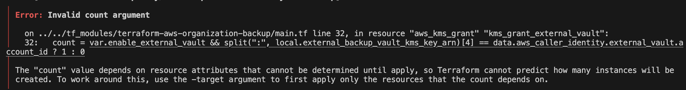

# Gotchas

## Enable External Vault



If you get the below error and you have external vault enabled in the module this is most likely because the KMS key for the external vault does not yet exist. Create the KMS key first before running the module.


## IAM Service Linked Role Error


If you have already tested or used the AWS Backup Service, then most likely AWS has already created this service linked role for you automatically. Then there is no need to use the below resource. Just comment it out and run the module once more.

```hcl
resource "aws_iam_service_linked_role" "backup_service_linked_role" {
  aws_service_name = "backup.amazonaws.com" # creates AWSServiceRoleForBackup
}
```

## AWS Backup Policy

Due to the complexity of the AWS Backup policy and the need to make it modular we opted to make a default plan that would need to be updated within the module itself.


